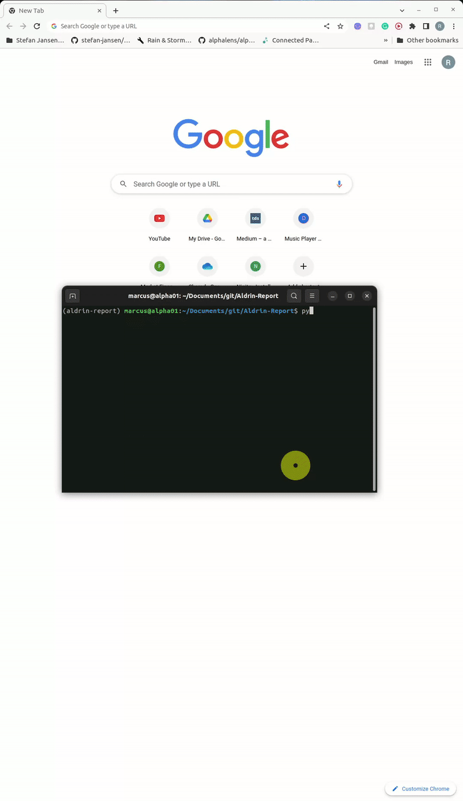
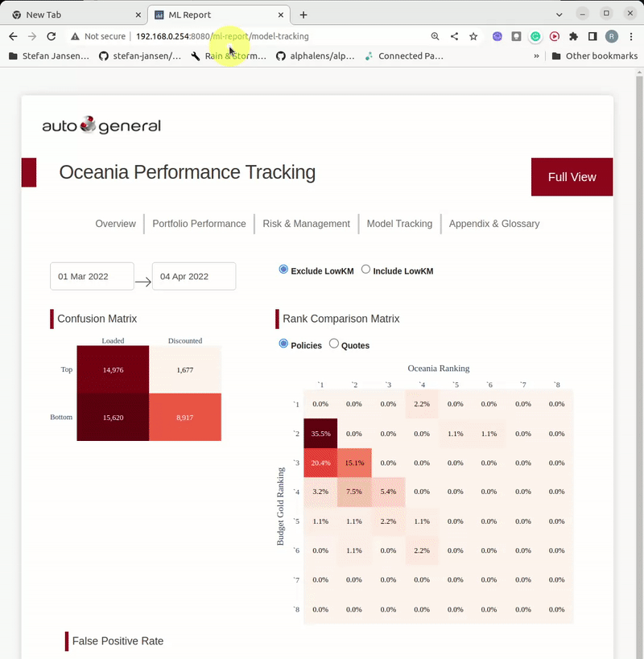

# Project Aldrin Monitoring Tool


## Overview
This is a repository for the project Aldrin reporting tool. General features are as below:






### Installation

To install and set up the ML-report, open up Anaconda Shell and follow the steps below:

1. Clone the repo and enter the directory

    ```
    git clone https://bitbucket.budgetdirect.com.au/scm/~mleong/aldrin-report.git
    ```
    ```
    cd {\your directory to\aldrin-report}
    ```
2. Create a virtual environment and avtivate

    ```
    python -m venv env
    ```
    ```
    .\env\Scripts\activate
    ```

3. Install the required dependencies

    ```
    pip install -r requirements.txt
    ```

4. Run on localhost
    ```
    python .\apprun.py
    ```

	report is available via the machine IP-adresses:8080


 


